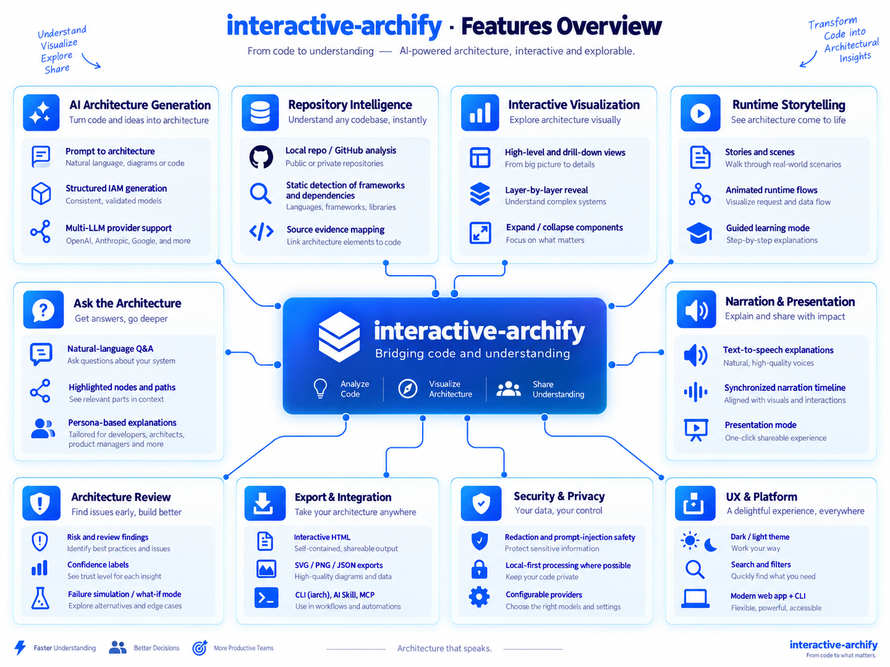
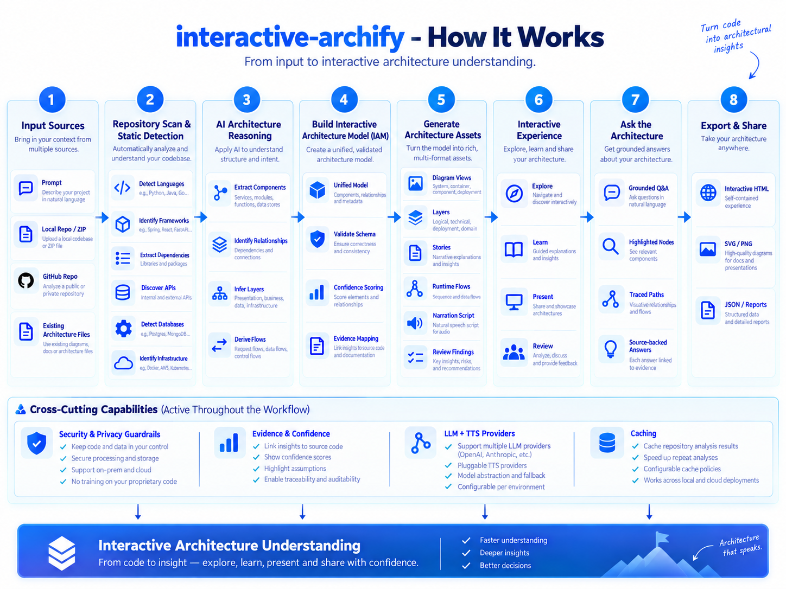
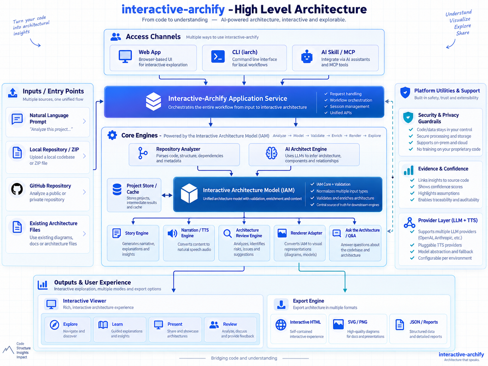

# interactive-archify

> **Architecture that explains itself.**

AI-powered interactive architecture storytelling. Turn system prompts and codebases into animated, explorable, narrated and evidence-backed architecture.



## What it includes

- Interactive Architecture Model (IAM), renderer-independent source of truth
- Prompt → architecture with OpenAI, Anthropic, Gemini, OpenAI-compatible models, or offline heuristics
- Local or public GitHub repository → evidence-backed architecture
- Layer-by-layer progressive disclosure
- Runtime flow modelling with topology validation
- AI-generated and deterministic architecture stories
- Browser narration plus cloud TTS provider adapters
- Ask the Architecture with grounded canvas actions
- Architecture review overlays with careful uncertainty wording
- Component evidence inspector
- Interactive HTML, SVG, PNG and JSON export
- Optional external Archify CLI adapter
- CLI aliases `interactive-archify` and `iarch`
- Installable AI skill under `skills/interactive-archify`
- Dark, responsive technical UI

## How it works



## Architecture



```text
Prompt / Repository
        |
        v
AI Architect / Static Analyzer
        |
        v
       IAM
   /    |      \\
Story  Review  Renderer
  |             |
Narration     SVG / Archify
   \\           /
    Interactive Runtime
```

IAM is deliberately above any renderer. The project ships a built-in SVG renderer, while `packages/archify-adapter` can call a user-installed Archify CLI.

## Quick start

Requirements: Node.js 20+, pnpm 9+.

```bash
pnpm install
cp .env.example .env.local
pnpm build
pnpm dev
```

Open the Next.js URL shown in your terminal.

Without API keys the application still works. Prompt generation falls back to deterministic technology recognition and repository analysis remains local-first.

## AI configuration

```env
AI_PROVIDER=openai
AI_MODEL=gpt-5.6-luna
OPENAI_API_KEY=...
```

Or use Anthropic, Gemini, Ollama/vLLM/SGLang/LM Studio through an OpenAI-compatible endpoint. See `docs/providers/AI.md`.

## CLI

```bash
iarch generate "Next.js API PostgreSQL Redis Stripe" --out architecture
iarch analyze ./my-repo --out architecture
iarch validate architecture/architecture.iam.json
iarch render architecture/architecture.iam.json --out architecture.svg
iarch review architecture/architecture.iam.json
iarch export architecture/architecture.iam.json --format html --out architecture.html
iarch serve architecture --port 4317
```

Generated project:

```text
architecture/
├── architecture.iam.json
├── architecture.svg
└── architecture.html
```

## Repository analysis

The analyser recognizes common manifests, APIs, databases, queues, caches, cloud services, Docker/Kubernetes/Terraform references and source evidence. It deliberately starts with static extraction so LLM reasoning is not required for every file.

Security controls include secret-file skipping, value redaction, binary/size limits, path protections and prompt-injection separation.

## Interactive modes

- **Explore**: pan, search, filter, focus, inspect layers and flows
- **Learn**: step through generated stories
- **Present**: autoplay with narration and semantic focus
- **Review**: inspect grounded architecture findings

## Ask the Architecture

Questions return both text and safe UI actions, for example focus a component or highlight authored relationships. The answer agent receives structured IAM, not a screenshot.

## TTS

Browser Web Speech is available directly in the viewer. Provider adapters are included for OpenAI and ElevenLabs, plus a Google TTS adapter. TTS is optional. Stories and captions still work without audio.

## Archify interoperability

The optional adapter converts IAM to a compact architecture IR and invokes a user-installed Archify CLI. Set:

```env
ARCHIFY_CLI_PATH=archify
```

Then:

```bash
iarch archify architecture.iam.json --out archify.html
```

No upstream renderer source is vendored here. If you vendor or redistribute Archify itself, preserve its required MIT copyright and license notices.

## Packages

```text
packages/core              IAM, graph, validation, deterministic layout
packages/ai                providers, architect, story, ask, review
packages/repo-analyzer     local static repository analysis and evidence
packages/story-engine      flow → scene/story generation
packages/story-runtime     timeline and playback engine
packages/narration         cloud TTS adapters and timing helpers
packages/renderer-runtime  built-in SVG renderer
packages/archify-adapter   optional upstream renderer integration
packages/exporters         HTML/SVG/JSON exports
packages/config            environment configuration
packages/cli               iarch command-line interface
packages/mcp-server        stdio MCP tool server
apps/web                   interactive Next.js workspace
```

## Examples

Five IAM examples live in `examples/`: SaaS, e-commerce, microservices, RAG and data platform.

## Development quality gates

```bash
pnpm typecheck
pnpm test
pnpm build
pnpm validate:examples
```

CI runs type checking, tests, builds and example validation.

## Current scope

This repository implements the complete V1 architecture foundation and user-facing workflows defined by the PRD. Some integrations depend on external providers or an externally installed Archify CLI. Video encoding beyond browser/standalone capabilities, collaborative SaaS hosting, IDE plugins and production telemetry overlays are intentionally later roadmap work.

## License

MIT. See `NOTICE` and `THIRD_PARTY_NOTICES.md` for interoperability attribution.

## MCP server

After build, run `interactive-archify-mcp` from `packages/mcp-server`. It exposes generation, local repository analysis, grounded explanation, review and export over a dependency-light JSON-RPC stdio surface.
